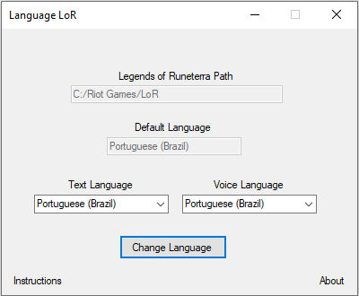
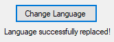

# Language LoR
Program that allows users to change text and voice languages without logging out from Legends of Runeterra and manually modifying files from game folder.

## Installation
Download it from [releases](https://github.com/lucas-carneiro/language-lor/releases), and then open it.

## Instructions

After opening Language LoR, it will automatically find your Legends of Runeterra install path, and its current language. Then choose your prefered text (UI and cards) and voice (dubbing) languages.

**If you choose a new text language**, it will replace your current language files with the new ones, which are already inside your game folder. 

**If you choose a new voice language**, it will replace your current language inside your configuration yaml file. Since sound files are only downloaded when your current language changes, they will be downloaded next time you open your game, similar to official updates.

**If you want to update both languages, first update the voice language, close the program and open the game. After it updates, close it and open the program again to change your text language.** Since voice language updates cause the game to update its files, any text language changes will be discarded.

After choosing your languages and pressing the "Change Language" button, a message saying "Language successfully replaced!" will appear, as the image above. You can close the program afterwards.

## Discarding Changes

**If you chose a new text language**, backup files were created inside your language folders. The folders are:
 - [LoR Install Path]/live/Game/LoR_Data/Plugins/locales/
 - [LoR Install Path]/live/PatcherData/PatchableFiles/GamePlayData/
 - [LoR Install Path]/live/Game/LoR_Data/StreamingAssets/EmbeddedGamePlayData/
Delete your current language files, and replace them with the backup files, which have the same name as the current ones, but with a **.bkp** extension.

**If you chose a new voice language or both**, simply open the program again and choose your previous language, as in the section above.

## Disclaimer
This program is not official and it is not affiliated, associated, authorized, endorsed by, or in any way officially connected with Riot Games or any of its subsidiaries.